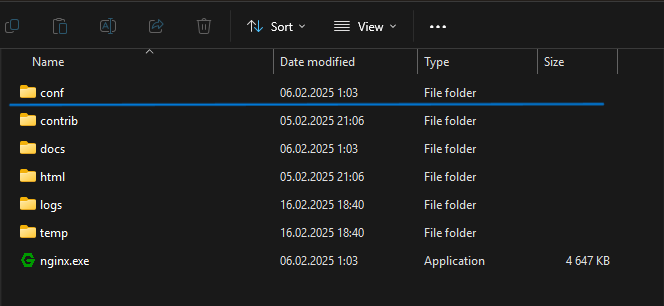
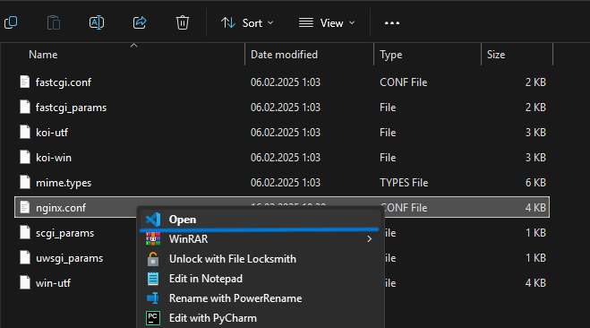

# TravelRoutes
Мы - команда Equal Squad из Хабаровского края выполнили отборочное задание на международный научный фестиваль школьников **Технострелка** по направлению *web-разработка*. Мы представляем наше решение:
 - [Backend](https://github.com/dem3tr0/TravelRoutes-Backend)
 - [Frontend](https://github.com/shamash22351/TravelRoutes-Frontend)
 - [Обзор функционала (видеопрезентация)](https://youtu.be/4qzZWND0Emg?si=ScfxwsNw48OLRFJp)
# Инструкция по сборке
Инструкция приведена для разверстки web-приложения **TravelRoutes** локально, т. е. на вашем компьютере. Никакие сервисы не находятся удаленно, кроме сторонних API, использованных в разработке приложения.
## 1. Установка всех необходимых приложений
Список необходимых компонентов:
 - Python 3.13
 - PostgreSQL 17.3
 - pgAdmin4 (платформа для администрирования и настройки СУБД PostgreSQL)
 - Nginx 1.27.4
 - NodeJS 22.14.0 LTS

> P.S. Установка Nginx и репозиториев веб-приложения выполняется в выделенную папку на вашем    
### 1.1 Установка Python
Скачайте и установите [Python](https://www.python.org/downloads/) версии не менее 3.13. Проверить корректность установки можно командой в cmd (powershell): ``` python --version pip --version ``` 
#### 1.2 Установка PostgreSQL и PgAdmin
Скачайте и установите [PostrgeSQL](https://www.postgresql.org/download/) версии не менее 17.3. 

Запустите PgAdmin для проверки корректности установки:
Введите пароль, который будет далее использоваться вами для взаимодействия с БД.

Впишите в поле "Port" 5432

Убедитесь, что по следующему пути в интерфейсе PgAdmin (Server -> PostgreSQL -> Databases ) у вас имеется хотя бы 1 база данных:

### 1.3 Установка Ngnix
Скачайте и установите [Ngnix](https://nginx.org/ru/download.html) версии не менее 1.27.4.
### 1.4 Установка Node JS 
Скачайте и установите [Node JS](https://nodejs.org/en/download) версии не менее 22.14.0 
### 1.5 Установка backend и frontend частей приложения 
В самом конце скачайте frontend и backend части нашего приложения с GitHub как zip архивы. Ссылки на репозитории указаны в самом начале файла `README.md`.
## 2. Настройка PostgreSQL

## 3. Установка компонентов для backend и frontend
Backend и frontend приложения требуют библиотеки и компоненты определенных версий, поэтому их тоже нужно установить
### 3.1 Компоненты React приложения
Для корректной работы frontend'а мы должны установить все компоненты с помощью пакетного менеджера npm. Перейдем в корневую папку фронтенд приложения:
```powershell
cd TravelRoutes-Frontend
```
Устанавливаем компоненты:
```powershell
npm install
```
### 3.2 Компоненты Django приложения
Опять же для корректной работы backend'a мы должны установить все компоненты, только уже с помощью встроенного пакетного менеджера pip. Перейдем в корневую папку бэкенд приложения:

> P.S Так как мы в прошлом пункте находились в корневой папке фронтенд приложения, мы должны вернуться в корневую папку всего проекта, выполнив дважды эту команду: 
>```
>cd ..
>```

Перейдем в корневую папку бэкенда:
```powershell
cd TravelRoutes-Backend
```
Установим и активируем виртуальную среду python:
```powershell
python -m venv .venv
```
Немного подождав, в директории где установлен проект появится папка виртуального окружения python с названием `.venv`. Ее активация отличается взависимости от исполняющего терминала (`cmd`, `powershell` и т. д.). Для powershell:
```powershell
.venv\Scripts\activate
```
Если все прошло успешно мы увидим измененную строку ввода:
```powershell
(.venv) PS E:\TravelRoutes\TravelRoutes-Backend>
```
Теперь установим все библиотеки. Мы подготовили файл `requirements.txt` со всеми библиотеками и их версиями, находящийся в корневой папке бэкенда. Выполним установку:
```powershell
pip install -r requirements.txt
```
Это может занять какое-то время.
## 4. Запуск frontend'а и backend'a
## 6. Настройка Nginx
Как уже было сказано в начале инструкции, все веб-приложение запускается локально, поэтому для доступа к его обеим частям (backend, frontend) по одному домену нам нужно настроить обратное проксирование. Для этого мы воспользуемся Nginx.

Перейдем в папку, где мы установили Nginx:



Откроем папку conf



Откроем файл `nginx.conf` как текстовый файл в любом текстовом редакторе, например в Visual Studio Code (хотя можно и в обчном блокноте). Вместо того, что написано в этом файле вам надо вставить конфигурацию ниже: 
```nginx
worker_processes 1;
events  {
	worker_connections  1024;
}
http  {
	include mime.types;
	default_type application/octet-stream;
	sendfile on;
	keepalive_timeout  65;
	
	upstream backend {
		server localhost:8000;
	}
	
	upstream frontend {
		server localhost:3000;
	}
	
	server  {
		listen  80;
		server_name localhost;
		location /api/ {
			proxy_pass  http://backend;
			proxy_set_header Host $host;
			proxy_set_header X-Real-IP $remote_addr;
			proxy_set_header X-Forwarded-For $proxy_add_x_forwarded_for;
			proxy_set_header X-Forwarded-Proto $scheme;
		}

		location / {
			proxy_pass  http://frontend;
			proxy_set_header Host $host;
			proxy_set_header X-Real-IP $remote_addr;
			proxy_set_header X-Forwarded-For $proxy_add_x_forwarded_for;
			proxy_set_header X-Forwarded-Proto $scheme;
		}
		
		error_page  500  502  503  504 /50x.html;

		location = /50x.html {
		root html;
		}
	}
}
```
Далее зайдем обратно в терминал и перейдем в корневую папку nginx:
```powershell
cd ПолныйПутьКПапкеПроекта\nginx
```

И заупстим файл `nginx.exe` командой:
```powershell
nginx.exe
```

Теперь мы можем проверить работу, зайдя в браузер и перейдя по адресу: `http://localhost`